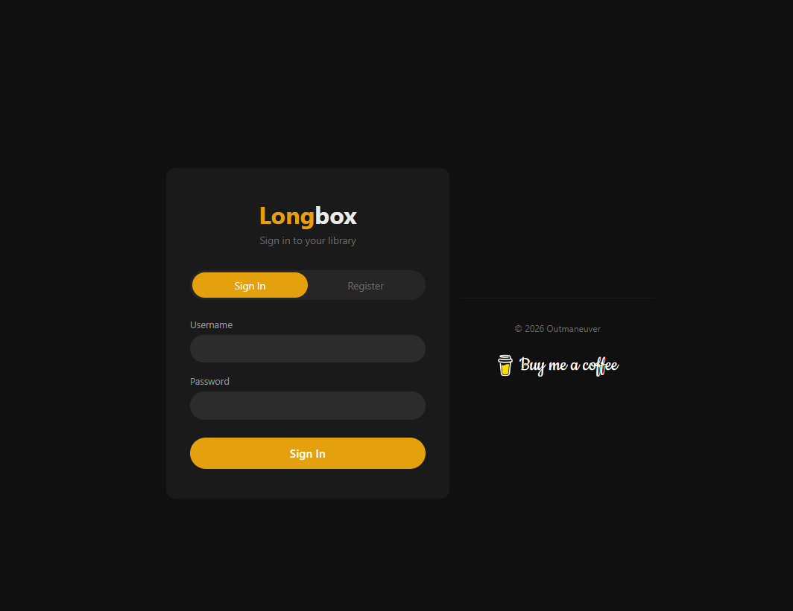
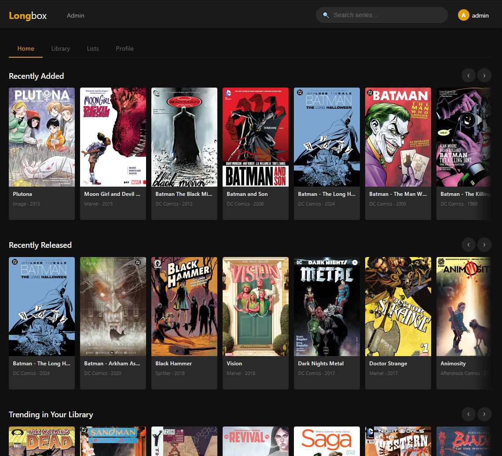
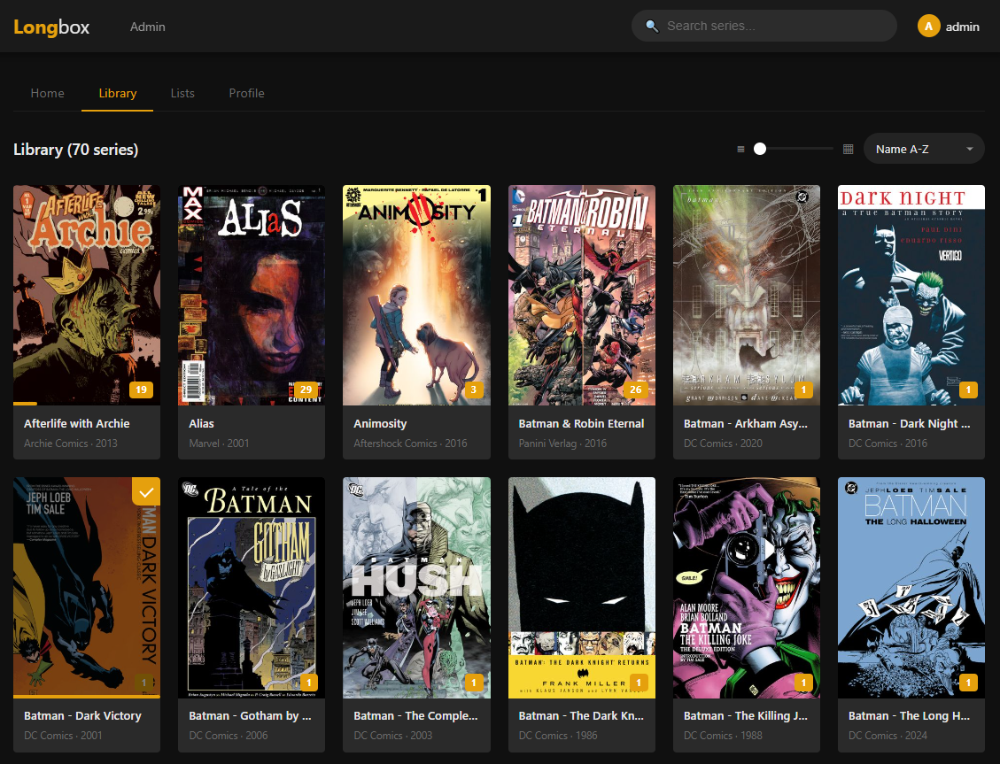
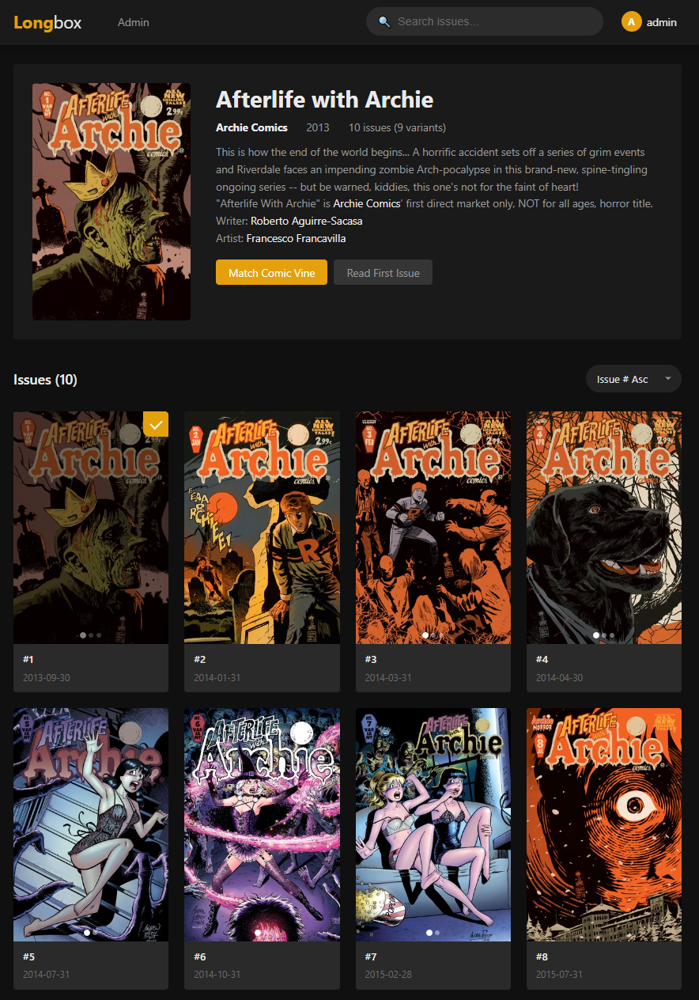
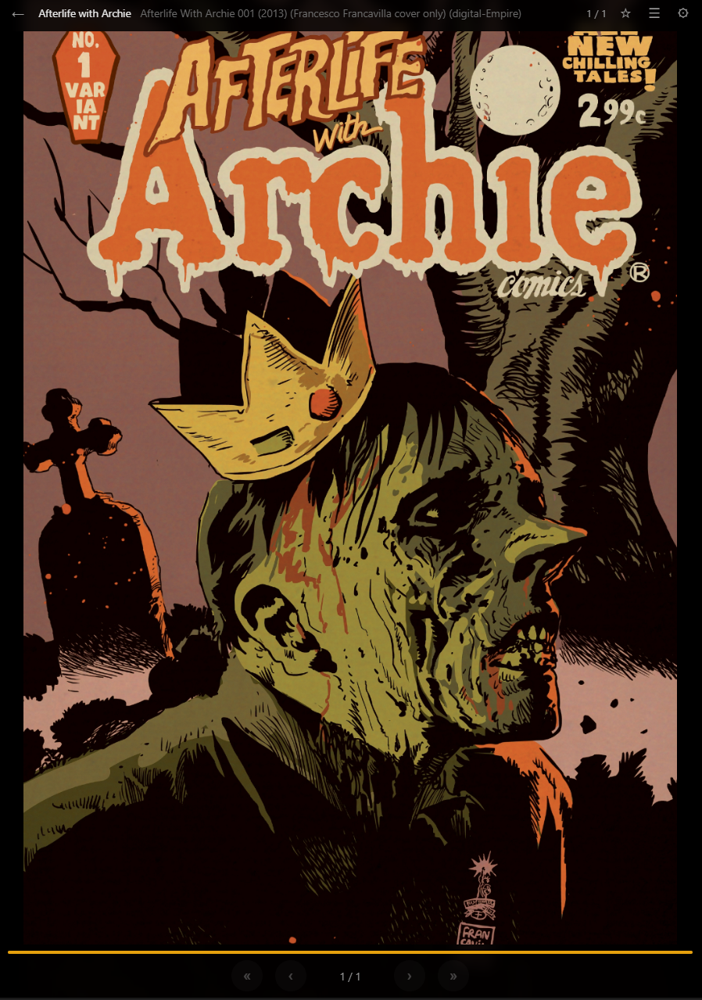
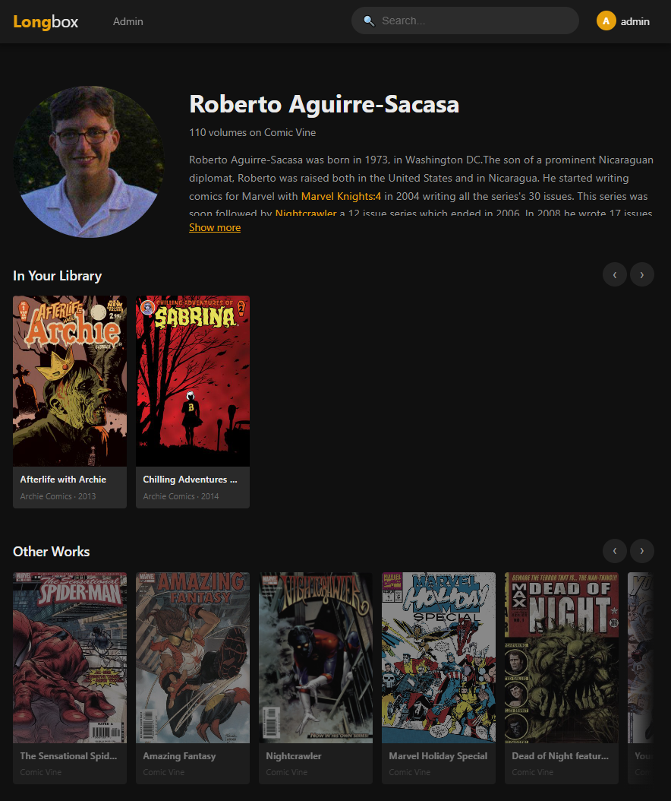
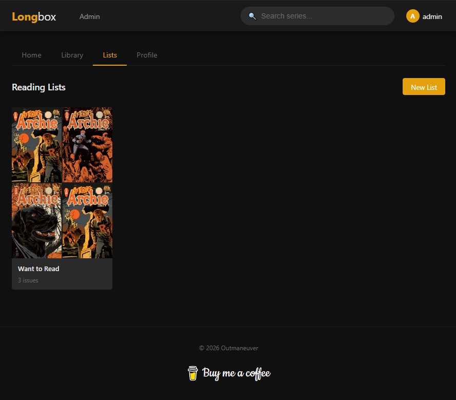
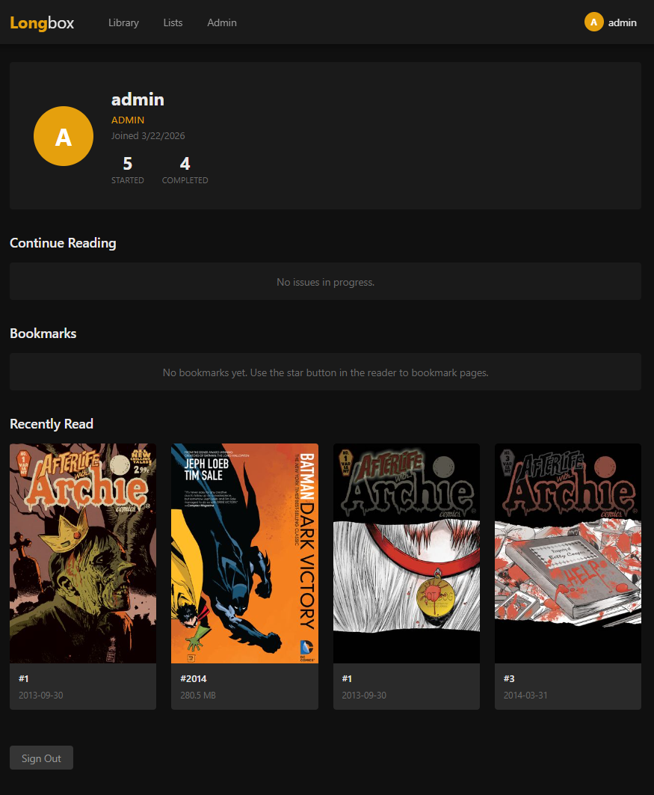
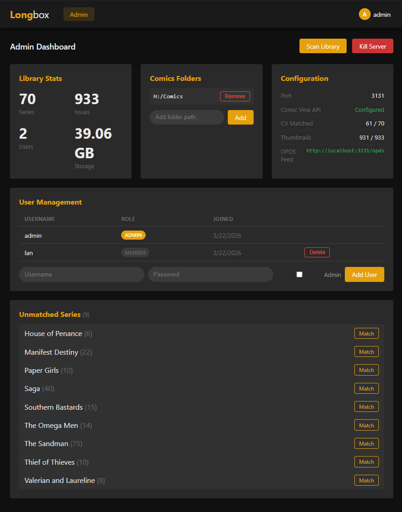

# Longbox

[](https://buymeacoffee.com/Outmaneuver)

Created by [Outmaneuver](https://outmaneuver.cargo.site/)

A self-hosted comic book server with a Plex-style dark UI. Organize, read, and track your digital comic collection (CBR/CBZ) from any browser or OPDS-compatible reader app.

## Features

- **Library Browser** — Plex-style dark grid with cover thumbnails, search, sort, and adjustable card sizes
- **Publishers Tab** — Browse by publisher with colored category cards, click to filter library
- **Ratings & Reviews** — Rate series 1-5 stars with optional text reviews, sort library by highest rated
- **Comic Reader** — Full-screen in-browser reader with keyboard shortcuts, swipe navigation, fit modes, pinch zoom, and page preloading
- **Comic Vine Integration** — Automatically fetches metadata (descriptions, publishers, cover dates, creators, characters) from Comic Vine API
- **Reading Progress** — Tracks your reading position per-issue, marks completed issues, shows progress on series cards
- **Bookmarks** — Save bookmarked pages with notes, jump back to them from your profile
- **Reading Lists** — Create custom lists, add individual issues or entire series at once from any card
- **Multi-User** — Session-based auth with admin/member roles, per-user progress, bookmarks, and ratings
- **User Profiles** — Customizable username and profile picture, reading stats, ratings & reviews overview
- **Creator Pages** — Click a writer/artist name to see their bio, your local comics they worked on, and their other works from Comic Vine
- **Variant Cover Grouping** — Multiple covers of the same issue are grouped into one card with hover rotation
- **OPDS Feed** — Connect external reader apps (Panels, Chunky, Librera) via OPDS catalog with HTTP Basic Auth
- **Admin Dashboard** — Library stats, scan trigger, user management, Comic Vine match status, bulk auto-match, multiple comics folder support
- **Docker Support** — Dockerfile and docker-compose.yml included for cross-platform deployment
- **Cloudflare Tunnel Ready** — Expose your local server securely over the internet with zero port forwarding
- **Nested Folder Support** — Subfolders within a series folder are detected as separate series
- **Large File Support** — CBZ files over 2GB (compendiums, omnibus editions) fully supported
- **Mobile Optimized** — Swipe between tabs, tap-to-reveal add-to-list, pinch zoom in reader, responsive admin page

## Screenshots

### Login


### Home


### Library


### Series Detail


### Comic Reader


### Creator Page


### Reading Lists


### Profile


### Admin Dashboard


## Installation

### Requirements
- [Node.js](https://nodejs.org/) v18 or later
- A folder of CBR/CBZ comic files organized into subfolders by series

### Quick Start

```bash
# Clone the repository
git clone https://github.com/miclovio/longbox.git
cd longbox

# Install dependencies
npm install

# Configure
cp .env.example .env
# Edit .env — set COMICS_PATH to your comics folder

# Start the server
npm start

# Visit http://localhost:3131
# The first user you register becomes the admin
```

### Docker

```bash
git clone https://github.com/miclovio/longbox.git
cd longbox

# Edit docker-compose.yml — set your comics path, session secret, and API key
docker compose up -d

# Visit http://localhost:3131
```

### Configuration (.env)

```env
PORT=3131
COMICS_PATH=H:/Comics
SESSION_SECRET=change-me-to-a-random-string
DATA_DIR=./data
COMICVINE_API_KEY=your-api-key-here
```

| Variable | Description | Required |
|----------|-------------|----------|
| `PORT` | Server port | No (default: 3131) |
| `COMICS_PATH` | Path(s) to your comics folders, comma-separated | Yes |
| `SESSION_SECRET` | Secret for session cookies | Yes |
| `DATA_DIR` | Where the database and thumbnails are stored | No (default: ./data) |
| `COMICVINE_API_KEY` | Free API key from [Comic Vine](https://comicvine.gamespot.com/api/) for metadata | No (but recommended) |

### Comics Folder Structure

Longbox treats each subfolder in your comics directory as a series:

```
H:/Comics/
  Saga/
    Saga 001.cbr
    Saga 002.cbr
  Batman - Year One/
    Batman - Year One #001.cbr
    Batman - Year One #002.cbr
  Batman - The Killing Joke.cbr    <-- loose files become their own series
```

- Subfolders = series
- Nested subfolders = separate series (e.g., `Invincible/Invincible Presents - Atom Eve/`)
- Loose CBR/CBZ files in the root = individual series (one-shots, graphic novels)
- Supports both CBR (RAR) and CBZ (ZIP) formats, including files over 2GB
- Handles mislabeled files (e.g., ZIP files with .cbr extension)
- Skips macOS ._ metadata files automatically

### Getting a Comic Vine API Key

1. Create a free account at [comicvine.gamespot.com](https://comicvine.gamespot.com/)
2. Go to [comicvine.gamespot.com/api/](https://comicvine.gamespot.com/api/)
3. Copy your API key
4. Add it to your `.env` file as `COMICVINE_API_KEY`

### OPDS (External Reader Apps)

Longbox serves an OPDS catalog for apps like Panels, Chunky, or Librera:

1. In your reader app, add a new OPDS catalog
2. URL: `http://your-server-ip:3131/opds`
3. Enter your Longbox username and password
4. Browse and download comics directly in the app

### Multiple Comics Folders

You can add multiple comics folders from the Admin dashboard, or comma-separate them in `.env`:

```env
COMICS_PATH=H:/Comics,D:/MoreComics,E:/Manga
```

## Tech Stack

- **Backend:** Node.js + Express
- **Database:** SQLite (via better-sqlite3)
- **Frontend:** Vanilla HTML/CSS/JS (no build step)
- **CBR/CBZ:** node-unrar-js + yauzl (streaming ZIP for large files) + system unrar fallback
- **Thumbnails:** Sharp
- **Metadata:** Comic Vine API
- **Deployment:** Docker + Cloudflare Tunnel

## License

ISC
Creative Commons
---

&copy; 2026 [Outmaneuver](https://outmaneuver.cargo.site/)
